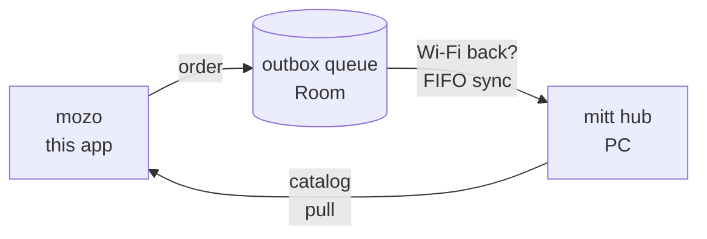

# mott — Android app for bar waitstaff

Native Android app for taking bar orders: pick a table, add products, get the bill automatically.
Offline-first against the [`mitt`](../mitt) PC hub — keep taking orders with no Wi-Fi, sync later.

> **Status:** foundation complete and build-verified (66 unit tests green, debug APK builds).
> Not field-tested in a real bar yet — see [Limitations](#limitations).

## Contents

- [How it works](#how-it-works)
- [Quick start](#quick-start)
- [Pairing with the hub](#pairing-with-the-hub)
- [Order flow](#order-flow)
- [Offline and sync](#offline-and-sync)
- [Catalog](#catalog)
- [Project layout](#project-layout)
- [Design tokens](#design-tokens)
- [Brand](#brand)
- [Compatibility](#compatibility)
- [Roadmap](#roadmap)
- [Contributing](#contributing)
- [Limitations](#limitations)

## How it works



1. **Pair** the phone with the PC hub once (QR or pasted code).
2. **Pull** the catalog from the hub: tables with occupancy (`GET /api/tables`)
   plus all products with prices and availability (`GET /api/products`,
   unfiltered — unavailable rows stay listed but disabled, same rule as web).
   The snapshot is cached on-device, so the flow keeps working offline.
3. **Take orders**: table → products → confirm. Totals compute on-device, instantly.
4. Every order lands in an **outbox queue**; a FIFO sync drains it to the hub when there is connectivity.

## Quick start

Requirements: Java 17+, Android SDK with platform `android-35` (set `ANDROID_HOME`).

```bash
export ANDROID_HOME=$HOME/android-sdk ANDROID_SDK_ROOT=$HOME/android-sdk
./gradlew :app:assembleDebug
./gradlew :app:testDebugUnitTest
```

The APK lands at `app/build/outputs/apk/debug/app-debug.apk`. Install it with
`adb install -r` or copy it to the phone.

## Pairing with the hub

On first run the app asks to pair. Two ways, same result:

- **Scan** the hub QR, or
- **Paste** the code.

The app validates the code against `GET /api/health` with the token and saves
the pairing locally (plain prefs for now — encrypted storage is on the roadmap).
Scanning uses the Play services code scanner (needs Play Services on device;
manual paste remains the fallback).

QR format (URL-encoded params):

```text
mitt://pair?url=http%3A%2F%2F192.168.1.20%3A8080&token=DUMMY-DUMMY-TOKEN-0000
```

Manual-paste fallback (`url|token`):

```text
http://192.168.1.20:8080|DUMMY-DUMMY-TOKEN-0000
```

Rules: scheme `mitt`, host `pair`, `http(s)` URL with explicit port, token of 16+ chars.
The token above is a DUMMY placeholder — never commit a real one.

## Order flow

Three taps from table to confirmed order:

| Step | Screen   | What happens                                              |
|------|----------|-----------------------------------------------------------|
| 1    | Tables   | Grid of tables with LIBRE / OCUPADA status (text + dot)   |
| 2    | Products | Rows with price, 48dp steppers, sticky total + CONFIRMAR   |
| 3    | Confirm  | Summary + table + total; offline banner when disconnected |

Design rules (night-bar first): dark theme default, big tabular numerals for money,
status never color-only, every screen has empty / error / offline states.

## Offline and sync

- Orders enqueue locally as typed ops (`SAVE_TAB`, …) with JSON payloads.
- `SyncManager.drainOnce()` sends them FIFO: `2xx` → done, `4xx` → dropped as
  poison (counted in the report), `5xx`/I-O → kept for later, order preserved.
- After 5 failed attempts an op is flagged exhausted instead of retried forever.
- The UI shows `SINCRONIZADO` or `PENDIENTE (n)` after each submission.

## Catalog

The hub is the single source of truth — no preset tables or products in the
production path. On Tables entry the app refreshes `ApiOrderCatalog` when
online (`GET /api/tables` + `GET /api/products`) and serves the last snapshot
otherwise. The snapshot lives in the `catalog` prefs (`CatalogCache`: tables +
products JSON + timestamp); Room stays the op-queue store, the catalog is a
small replace-whole snapshot by design. `FakeOrderCatalog` exists for
previews and JVM tests only.

## Project layout

| Path                           | Purpose                                            |
|--------------------------------|----------------------------------------------------|
| `app/`                         | `:app` module (`dev.mott.app`), Compose + Material3|
| `…/domain/`                    | Offline rules: product, order line, tab, expense    |
| `…/data/local/`                | Room cache + outbox queue (`PendingOp`)            |
| `…/data/remote/`               | Retrofit client + DTOs matching the mitt wire (`BrandingResponse` for hub brand)|
| `…/data/`                      | `PairingStore`, `PairingCode`, `SyncManager`, `BrandStore`, `BrandRefresh`, `CatalogCache`, `ApiOrderCatalog`|
| `…/ui/order/`                  | 3-tap flow: ViewModel + tables/products/confirm     |
| `…/ui/pair/`                   | Pairing screen (scan + paste)                       |
| `…/ui/theme/`                  | `MottTheme`, token-driven colors, total text styles |
| `gradle/libs.versions.toml`    | Version catalog (AGP, Kotlin, Compose, Room…)       |
| `odd/tasks/`                   | Local planning only — **not committed** (git-ignored)|

## Design tokens

Theme roles copy the shared token set 1:1 from mitt [`docs/design-tokens.md`](../../mitt/docs/design-tokens.md)
(reference only): dark-first roles, type/spacing scales, 48dp touch minimums.
Token hex values in `Theme.kt` carry the token-name comments — change the token doc
first, then mirror here, so PC and phone stay visually consistent.

## Brand

Shop name and colors come from the hub, not from the app: public
`GET /api/branding` (`shop_name`, `primary`, `accent`, `background`) is fetched
on pairing and on app start when online, then cached in `brand` prefs. Offline
or failed refreshes keep the cached values silently, falling back to the mitt
dark tokens. The theme follows the device (no in-app toggle); the hub accent
drives actions in both modes and hub background/primary drive dark-mode
surfaces, with readable on-colors picked by luminance. The hub logo stays
web-only — the app ships no image-loading dependencies by design.

## Compatibility

| What      | Supported from                                      |
|-----------|-----------------------------------------------------|
| Android   | 8.0 (API 26) and up                                 |
| Hub       | `mitt` on the same Wi-Fi (Windows 10+ / any Linux)  |
| Build     | Gradle wrapper committed — no system Gradle needed  |

## Roadmap

- Per-person split inside a table.
- Encrypted pairing storage, push-free LAN discovery.
- Rendered sync status on the confirm screen (state exists, label pending).
- On-device test pass (QR scan, camera rationale, live-hub pairing).

## Contributing

Open source — adjust it to your bar's needs. Conventions:

- Conventional Commits (`feat:`, `fix:`, `docs:`, …), one work unit per commit.
- JVM tests travel with behavior: `./gradlew :app:testDebugUnitTest` stays green.
- No secrets in the repo: no `local.properties`, no keystores, no real tokens.

## Limitations

- QR scanning, camera permission flow, and live-hub pairing are unit-tested only —
  no device/emulator pass yet.
- Pairing secrets use plain prefs (hardening tracked).
- Today-sales depends on an upcoming hub endpoint (documented there).
